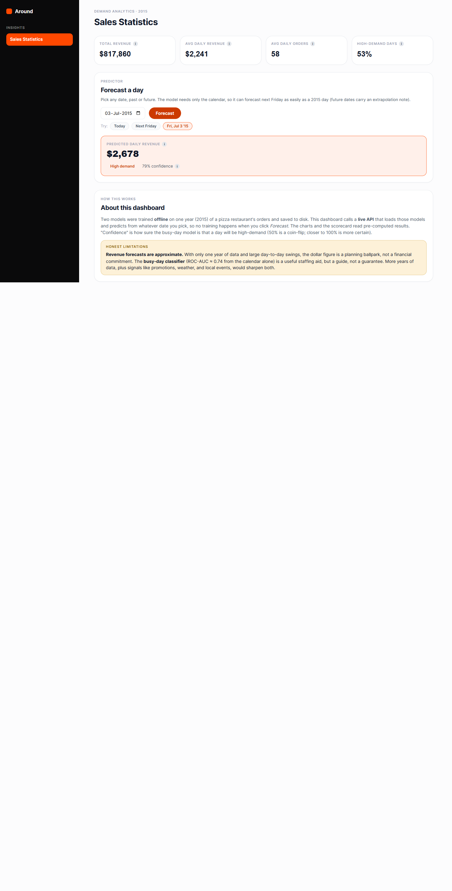
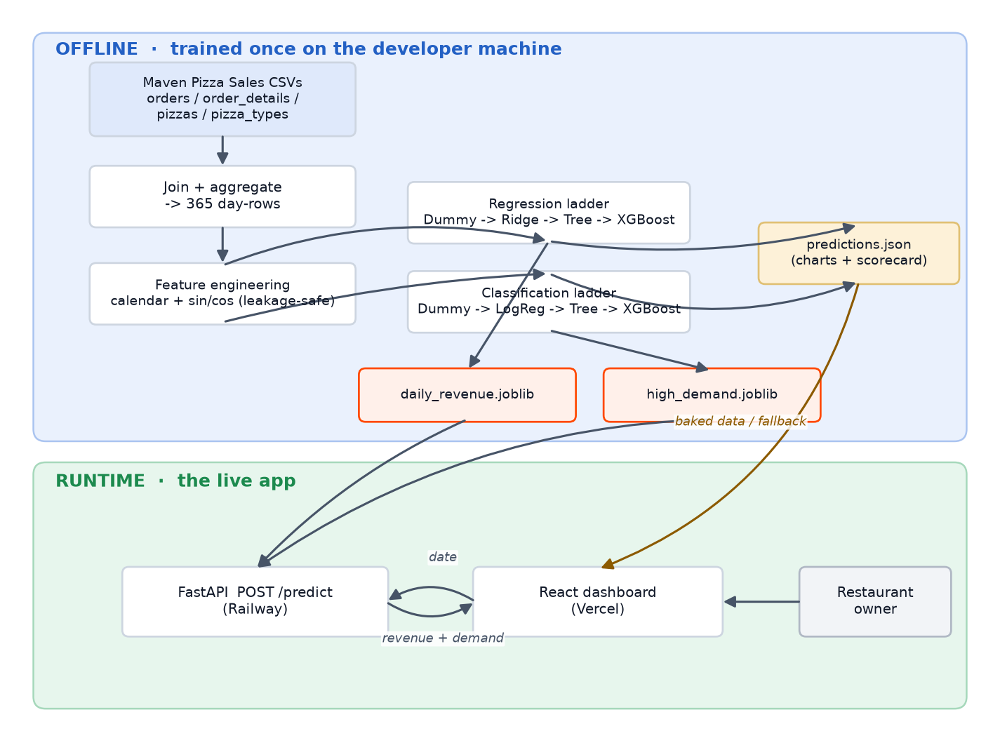

# Restaurant Demand Analytics

[](https://github.com/popovskik/IMB-Sales-Prediction-Project/actions/workflows/ci.yml)

Predicting a pizza restaurant's **daily revenue** (regression) and flagging **high-demand days** (classification) from a full year of order data — an end-to-end machine learning study with a live, deployed prediction app.

> IMB MADA 2026 capstone. Dataset: [Maven Analytics Pizza Place Sales](https://mavenanalytics.io/data-playground/pizza-place-sales) (public, no personal data).

## Live app

- **Dashboard (Vercel):** https://imb-sales-prediction-project.vercel.app
- **Prediction API (Railway):** https://imb-sales-prediction-project-production.up.railway.app — try [`/docs`](https://imb-sales-prediction-project-production.up.railway.app/docs) or [`/health`](https://imb-sales-prediction-project-production.up.railway.app/health)



*Verified end-to-end locally: the React dashboard calls the FastAPI `/predict` endpoint and
renders a live prediction (e.g. 2015-07-03 → $2,678, High demand, 79% confidence).*

## Deliverables

| # | Deliverable | Location |
|---|---|---|
| D0 | Solution architecture | [`architecture.png`](architecture.png) · [`architecture.md`](architecture.md) |
| D1 | Analysis report (Quarto → HTML) | [`analysis/report.qmd`](analysis/report.qmd) → `report.html` |
| D2 | Deployed app | `app/` (React/Vercel) + `api/` (FastAPI/Railway) |
| D3 | AI-workflow reflection | [`docs/ai-reflection.md`](docs/ai-reflection.md) |
| D4 | Presentation slides | [`slides/presentation.qmd`](slides/presentation.qmd) → `presentation.html` |
| D5 | Executive summary | [`docs/executive-summary.md`](docs/executive-summary.md) |

## What it does

Two day-level prediction questions, answered honestly:

1. **Regression** — predict `Daily_Revenue` (sum of price × quantity across a day's orders).
2. **Classification** — predict `High_Demand_Day` (a day whose order count exceeds the year's mean daily order count).

Both models use only calendar features derived from the date (no leakage). The pipeline trains a full model ladder (Dummy → linear → Decision Tree → tuned XGBoost) and reports test-set metrics with the baseline kept in the leaderboard. A SARIMA time-series benchmark (with ADF/ACF/PACF diagnostics in the report) cross-checks the regression ceiling, and the dashboard shows the ROC curve, confusion matrix, and Nov–Dec forecast-vs-actual chart.

## Architecture



Training happens **offline, once**: the CSVs are joined, aggregated to 365 day-rows, and used
to train two models saved as `.joblib`. At **runtime**, the FastAPI service loads them and the
React dashboard calls `/predict`; no training happens live. See [`architecture.md`](architecture.md).

## Repository layout

```
analysis/   ML pipeline + Quarto report (D1)
api/        FastAPI prediction service (D2 — Railway)
app/        React dashboard (D2 — Vercel)
slides/     reveal.js presentation (D4)
docs/       executive summary (D5), AI-workflow reflection (D3)
```

## Run it yourself (from a clean clone)

Everything is seeded (`RANDOM_SEED = 42`) and reproduces from a clean checkout. Commands
assume the repo root; the venv path uses Windows syntax (`source .venv/bin/activate` on macOS/Linux).

```bash
# (a) install the analysis environment
cd analysis
python -m venv .venv && .venv/Scripts/activate
pip install -r requirements.txt

# (b) run the tests (data-integrity + leakage guards + model checks)
pytest                       # 49 tests

# (c) rebuild every artifact in one command (data -> train -> predictions.json,
#     and sync the models into api/ for deploy). Add --report to also render the report.
python rebuild.py            # or: python rebuild.py --report

# (d) render just the analysis report (D1)
quarto render report.qmd     # produces report.html

# (e) run the prediction API locally  (new terminal, from repo root)
cd api && pip install -r requirements.txt
uvicorn main:app --reload    # http://localhost:8000  (/docs, /health)

# (f) run the dashboard locally  (new terminal)
cd app && npm install
echo "VITE_API_URL=http://localhost:8000" > .env.local   # point the predictor at your local API
npm run dev                  # http://localhost:5173
```

> The full ML pipeline lives in `analysis/src/` (`data` → `eda` → `features` → `models`) and is
> exercised by the test suite; `rebuild.py` is the single entry point that regenerates the
> trained models, the leaderboard, and the dashboard's `predictions.json` deterministically.
