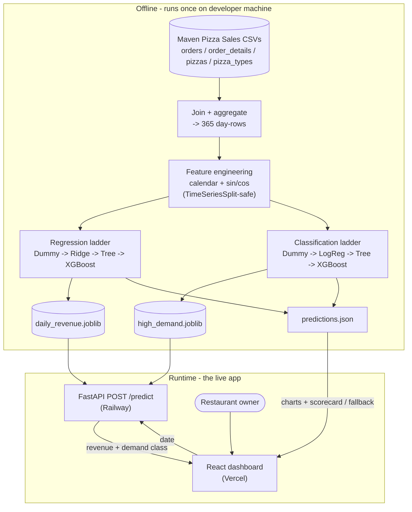

# Solution Architecture (D0)

## Diagram source (Mermaid)

## Written explanation (training vs. inference)

Training happens **offline, once**, on the developer machine: the four source CSVs are
joined, aggregated to 365 day-level rows, and feature-engineered, then used to train two
XGBoost models — one for daily-revenue regression, one for high-demand-day classification —
which are serialized as `daily_revenue.joblib` and `high_demand.joblib`.

Inference happens **at runtime** in the deployed app. The FastAPI backend (on Railway) loads
both `.joblib` files **once at startup**; when a user picks a date in the React frontend (on
Vercel), the backend recomputes that date's calendar features and calls `model.predict()`,
returning the predicted revenue and the high-demand class. **No training happens at runtime.**

The trained models reach the running app by being saved to disk as `.joblib` files and loaded
by the FastAPI service at startup. Pre-computed outputs are also baked into `predictions.json`,
which the dashboard reads for its charts and model scorecard and uses as a fallback while the
API cold-starts.
